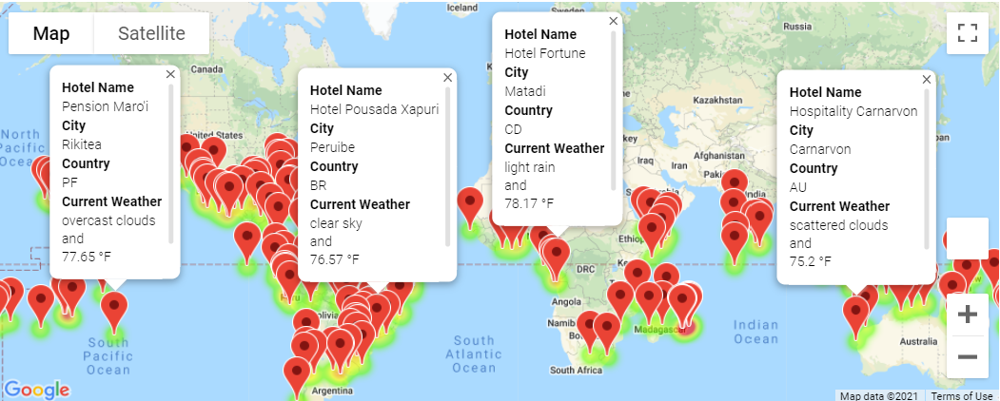
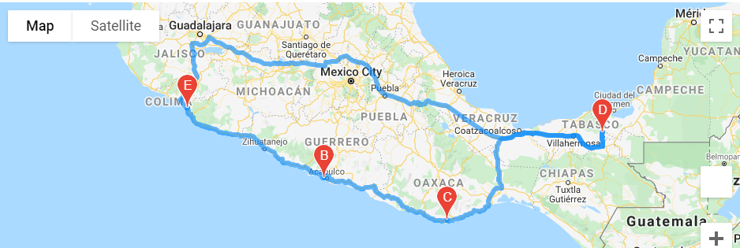
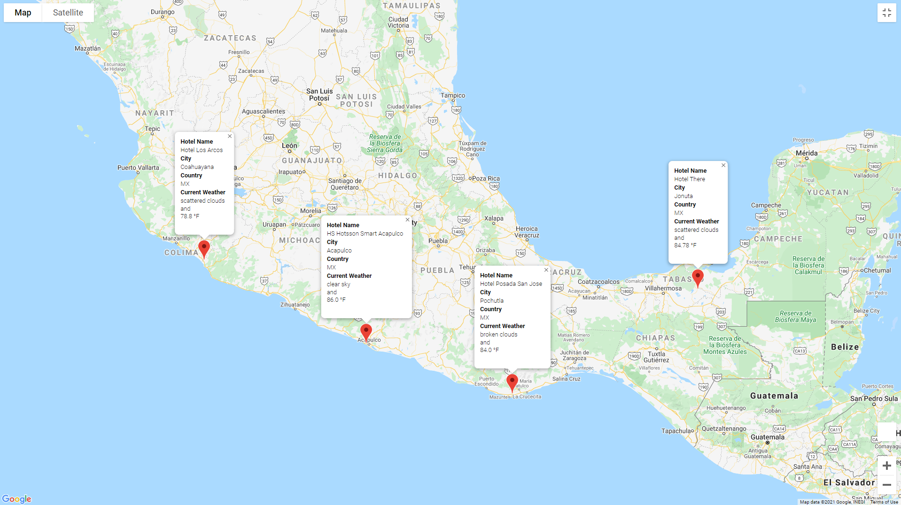

# World Weather Analysis
## Resources 
Jupyter Notebook, Python 3.7, Pandas Library, citipy, Matplotlib, numpy, requests, gmaps API, openweathermaps API

## Overview
After Beta testers loved the PlanMyTrip app, updates were made based on their suggestions. Weather descriptions were added to the weather data presented, input statements were used to filter the preferred weather conditions to locate potential destinations and hotels. The goal is to have the beta testers choose four cities, create a travel itinerary, and use Google Maps Directions API to create a travel route between the designated cities.

### Deliverable 1: Retrieve Weather Data
* Code: [Weather_Database.ipynb](Weather_Database/Weather_Database.ipynb)
* Exported DataFrame: [WeatherPy_Database.csv](Weather_Database/WeatherPy_Database.csv)

### Deliverable 2: Create a Customer Destinations Map
* Code: [Vacation_Search.ipynb](Vacation_Search/Vacation_Search.ipynb)
* Exported DataFrame: [WeatherPy_vacation.csv](Vacation_Search/WeatherPy_vacation.csv)
* WeatherPy Vacation Map:

### Deliverable 3: Create a Travel Itinerary Map 
* Code: [Vacation_Itinerary.ipynb](Vacation_Itinerary/Vacation_Itinerary.ipynb)
* WeatherPy Travel Map: 

* WeatherPy Travel Map Markers: 

